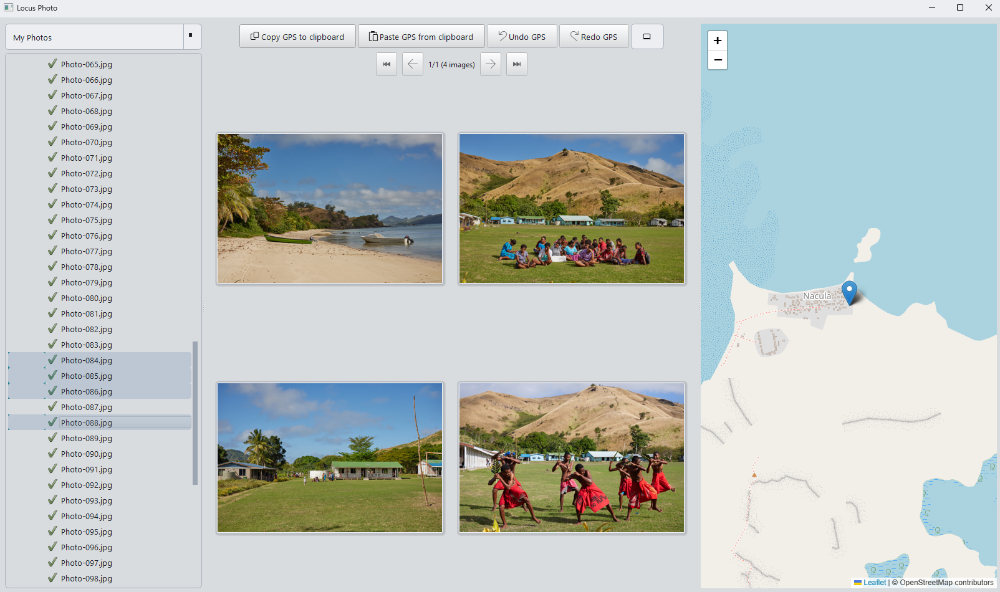

# Locus Photo

A cross-platform photo viewer with GPS metadata editing, map integration, and RAW format support.
It can be run with Python or built as a standalong binary on a target platform.

> **Bundled software:** Locus Photo includes a copy of **ExifTool 13.55** by Phil Harvey (<https://www.exiftool.org>), licensed under the GNU General Public License v3.0 or the Artistic License. ExifTool is used as an external process for reading and writing photo metadata. See [Credits](#credits) and [THIRD_PARTY_LICENSES.txt](THIRD_PARTY_LICENSES.txt) for the full attribution and license terms.

## Screenshots



## Features

Add missing GPS coordinates to photos.

The software has been tested on Windows and Ubuntu and in principle should work on Mac OS.

Overview of functionality:
- Browse photos
- View and set GPS coordinates on a map, or copy from other photos
- RAW format support (via rawpy and metadata previews)

## Requirements

- Python 3.11+
- On Linux: `libxcb-cursor0` and related Qt dependencies (see `locus-photo-installer.sh` for the full list)
- ExifTool binaries are bundled for Windows and Linux in [exiftool/](exiftool/)

## Installation (from source)

```bash
git clone https://github.com/kp9991-git/locus-photo.git
cd locus-photo
python -m venv .venv

# Windows
.venv\Scripts\activate

# macOS / Linux
source .venv/bin/activate

pip install -e .
python main.py
```

## Running the tests

```bash
pip install -e ".[dev]"
pytest
```

Tests run headlessly via Qt's `offscreen` platform — no display required.

## Building a standalone binary

PyInstaller build scripts are provided for each platform:

- Windows: `locus-photo-installer.cmd`
- macOS / Linux: `locus-photo-installer.sh`

Install build extras first: `pip install -e ".[build]"`. The resulting executable is written to `dist/release/`.

## Configuration

On first run, `.locus-photo-config.yaml` is copied to your home directory. It controls:

- `base_dirs` / `base_dir_labels` — folders to browse (supports `$$$PICTURES$$$` and `$$$USERNAME$$$` placeholders, plus UNC paths)
- `logging`
- GUI settings

## Credits

This software contains **ExifTool 13.55** created by Phil Harvey. ExifTool is invoked as a separate process and is licensed under the [GNU General Public License v3.0 or the Artistic License](https://www.exiftool.org/index.html#license). Source: <https://www.exiftool.org>. The full license text is also bundled alongside the ExifTool binary inside this distribution.

This software uses **OpenStreetMap**. Map data © OpenStreetMap contributors, licensed under the [Open Database License (ODbL)](https://www.openstreetmap.org/copyright).

Other dependencies: PySide6 (LGPLv3), numpy, rawpy, Pillow, PyYAML, geocoder, pyperclip, pyexiftool.

## License

Copyright (C) 2026 Kyrylo Protsenko.

Licensed under the GNU General Public License v3.0 or later — see [LICENSE](LICENSE) for the full license text and [NOTICE](NOTICE) for the project-specific copyright and warranty notice. This choice is driven by the bundled ExifTool binary, which is GPL-3.0.

## Terms of Use

This software modifies photo files and embedded metadata (including GPS coordinates). Those modifications may be irreversible. By using Locus Photo you agree to the terms in [TERMS_OF_USE.txt](TERMS_OF_USE.txt), which include a disclaimer of warranty and limitation of liability, and place responsibility for backups on the user. On first launch the application will ask you to accept these terms.
